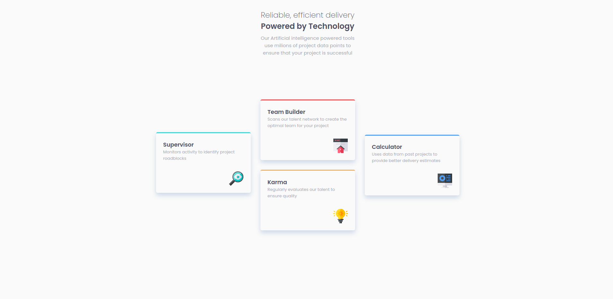

# Frontend Mentor - Four card feature section solution

This is a solution to the [Four card feature section challenge on Frontend Mentor](https://www.frontendmentor.io/challenges/four-card-feature-section-weK1eFYK).

Your challenge is to build out this feature section and get it looking as close to the design as possible.
Frontend Mentor challenges help you improve your coding skills by building realistic projects.

### Screenshot

## design :

### Desktop

### Mobile

### My Resolution :

#### Desktop

  

#### Desktop

  
